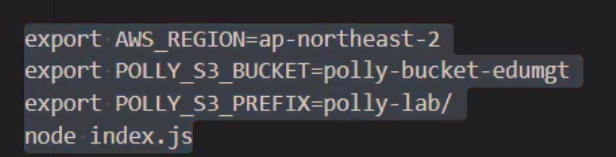
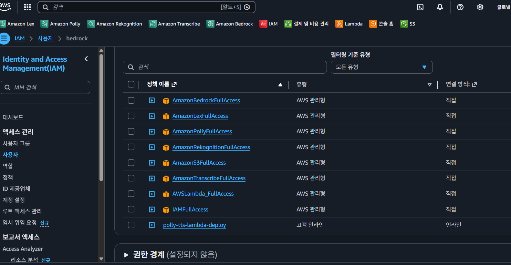
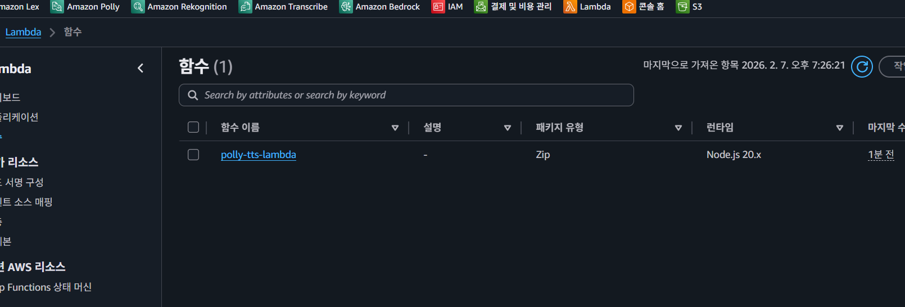
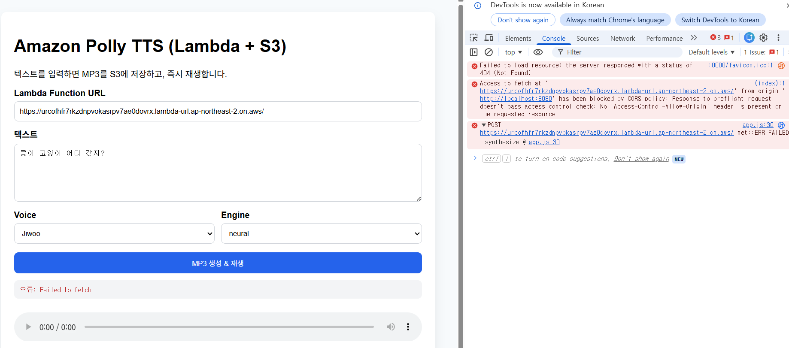
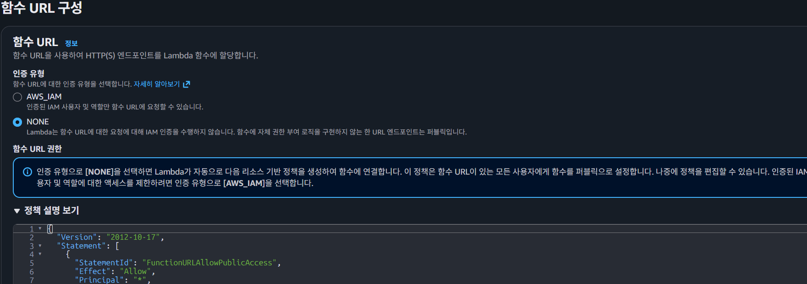
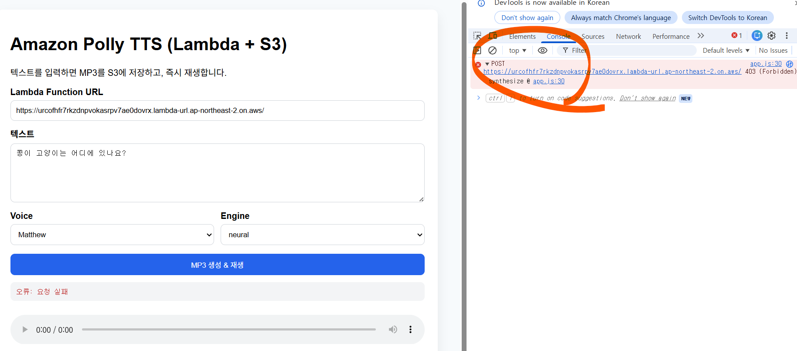

# Amazon Polly + Node.js 실습 레포 (AI-AWS-Polly)

## 기술 스택 (이 레포 실습에 필요한 구성)

### 런타임 / 언어
- **Node.js 18+**: 서버(Express)와 Lambda 핸들러 실행 환경
- **JavaScript (ES Modules/CommonJS 혼용 가능)**: 실습 코드 작성 언어

### AWS 서비스
- **Amazon Polly**: 텍스트를 음성(MP3/OGG/PCM)으로 변환
- **AWS Lambda (Function URL)**: TTS API 서버리스 실행
- **Amazon S3**: 생성된 음성 파일 저장 및 정적 접근
- **AWS IAM**: Lambda 실행 역할/권한 및 배포 권한 관리

### SDK / API / 배포 도구
- **AWS SDK for JavaScript v3**: Polly/S3 등 AWS API 호출
- **AWS CLI**: IAM 정책 적용, Lambda 배포/업데이트, S3 CORS 설정
- **Bash 스크립트 (`infra/aws-cli-deploy-lambda.sh`)**: CLI 기반 배포 자동화

### 웹/애플리케이션 구성
- **Express (server/)**: 기존 실습용 API 서버
- **Frontend (Vanilla HTML/CSS/JS)**: 텍스트 입력, 음성 생성 요청, 재생 UI
- **HTTP 정적 서버 (`http-server`)**: `frontend/` 로컬 실행
- **CORS 설정**: 로컬 프론트엔드와 Lambda Function URL 연동

### 개발/실습 환경
- **zip/unzip**: Lambda 배포 패키징 보조 도구
- **Linux/WSL/터미널 환경**: 제공된 스크립트 및 AWS CLI 명령 실행 환경
- **AWS 계정 및 사전 구성**: AWS CLI 로그인, S3 버킷 준비

Amazon Polly(Text-to-Speech)를 Node.js(AWS SDK v3)로 호출해 다음을 실습합니다.
- MP3/OGG/PCM 생성
- SSML 제어
- Speech Marks 생성
- S3 저장 및 Presigned URL 재생
- **Lambda + Frontend 기반 텍스트→MP3 저장/재생 모듈**

## 프로젝트 구조
```
AI-AWS-Polly/
  server/                     # 기존 Express 실습 API
  lambda/                     # AWS Lambda 핸들러(Node.js)
  frontend/                   # 브라우저 입력/재생 UI
  infra/aws-cli-deploy-lambda.sh
  docs/
    chapters/Chapter01~10.md  # 커리큘럼형 학습 문서
```

## 1) 커리큘럼 학습
- `docs/chapters/README.md`에서 Chapter01~10 순서로 학습하세요.

## 2) Lambda 배포 (AWS CLI)
사전 요구사항
- AWS CLI 로그인 완료
- Node.js 18+
- S3 버킷 1개

```
sudo apt-get update
sudo apt-get install -y zip unzip
```
---

```
aws iam put-user-policy \
  --user-name admin \
  --policy-name polly-tts-lambda-deploy \
  --policy-document file://polly-lambda-deploy.json
```


---




```bash
export AWS_REGION=ap-northeast-2
export LAMBDA_NAME=polly-tts-lambda
export ROLE_NAME=polly-tts-lambda-role
export POLLY_S3_BUCKET=demo-hdb-edumgt-example
export CORS_ALLOW_ORIGIN='*'
sudo ./infra/aws-cli-deploy-lambda.sh
```
#### POLLY_S3_BUCKET 의 버킷명은 전세계 고유할 것으로 예상하는 이름으로 줄것

#### 다음의 에러가 보일 경우 update 대기필요
```
An error occurred (ResourceConflictException) when calling the UpdateFunctionConfiguration operation: The operation cannot be performed at this time. An update is in progress for resource: arn:aws:lambda:ap-northeast-2:086015456585:function:polly-tts-lambda
```
---
```
aws lambda wait function-updated --function-name polly-tts-lambda
# (있으면) v2도 가능
aws lambda wait function-updated-v2 --function-name polly-tts-lambda
```
---
```
root@DESKTOP-D6A344Q:/home/AI-AWS-Polly# aws lambda get-function-configuration \
  --function-name polly-tts-lambda \
  --query '{LastUpdateStatus:LastUpdateStatus,Reason:LastUpdateStatusReason}' \
  --output table
--------------------------------
|   GetFunctionConfiguration   |
+-------------------+----------+
| LastUpdateStatus  | Reason   |
+-------------------+----------+
|  Successful       |  None    |
+-------------------+----------+
```

배포가 끝나면 Function URL이 출력됩니다.

---
```
[19:24:45] [2/8] IAM role create (if not exists)
[19:24:46] [3/8] Attach policies
[19:24:49] [4/8] Ensure S3 bucket exists (create if missing)
[19:24:50]   - bucket not accessible or not exists: polly-bucket-edumgt (head-bucket rc=254)
[19:24:50]   - trying to create bucket in region: ap-northeast-2
[19:24:51]   - bucket created: polly-bucket-edumgt
[19:24:51] [5/8] Lambda create/update (conflict-safe)
[19:25:15] [6/8] Function URL create/get
[19:25:18] [7/8] S3 bucket CORS apply
[19:25:20]   - bucket CORS applied: polly-bucket-edumgt
[19:25:20] [8/8] Done

완료:
 - Function URL: https://urcofhfr7rkzdnpvokasrpv7ae0dovrx.lambda-url.ap-northeast-2.on.aws/
 - S3 Bucket   : polly-bucket-edumgt
 - S3 Prefix   : polly-lab/
 ```




## 3) Frontend 실행
정적 파일 서버로 `frontend/`를 사용합니다. Repo 상위 폴더에서 http-server frontend -p 8080 실행

```bash
npm i -g http-server
http-server frontend -p 8080

# 브라우저에서 http://localhost:8080 접속
```

사용 방법
1. Lambda Function URL 입력
2. 텍스트 입력
3. Voice/Engine 선택
4. `MP3 생성 & 재생` 클릭
5. MP3가 S3에 저장되고 즉시 재생

---
### CORS 오류 발생 시

```
debian@DESKTOP-OJOTK17:~/project/AI-AWS-Polly$ URL="https://2jo52ugrpxfmdnkbqqetznpfoa0banot.lambda-url.ap-northeast-2.on.aws/" 

# preflight 재현
curl -i -X OPTIONS "$URL" \
  -H "Origin: http://localhost:8080" \
  -H "Access-Control-Request-Method: POST" \
  -H "Access-Control-Request-Headers: content-type"
HTTP/1.1 403 Forbidden
Date: Mon, 09 Feb 2026 07:38:07 GMT
Content-Type: application/json
Content-Length: 144
Connection: keep-alive
x-amzn-RequestId: 6c2ba115-254e-4145-a115-a8c8da97230c
x-amzn-ErrorType: AccessDeniedException

{"Message":"Forbidden. For troubleshooting Function URL authorization issues, see: https://docs.aws.amazon.com/lambda/latest/dg/urls-auth.html"}debian@DESKTOP-OJOTK17:~/project/AI-AWS-Polly$ 
```



```
root@DESKTOP-D6A344Q:/home/AI-AWS-Polly/server# aws lambda update-function-url-config \
  --function-name polly-tts-lambda \
  --auth-type NONE \
  --cors '{
    "AllowOrigins":["http://localhost:8080"],
    "AllowMethods":["POST"],
    "AllowHeaders":["content-type"],
    "ExposeHeaders":["content-type"],
    "MaxAge":86400
  }'
{
    "FunctionUrl": "https://urcofhfr7rkzdnpvokasrpv7ae0dovrx.lambda-url.ap-northeast-2.on.aws/",
    "FunctionArn": "arn:aws:lambda:ap-northeast-2:086015456585:function:polly-tts-lambda",
    "AuthType": "NONE",
    "Cors": {
        "AllowHeaders": [
            "content-type"
        ],
        "AllowMethods": [
            "POST"
        ],
        "AllowOrigins": [
            "http://localhost:8080"
        ],
        "ExposeHeaders": [
            "content-type"
        ],
        "MaxAge": 86400
    },
    "CreationTime": "2026-02-07T10:13:13.984183027Z",
    "LastModifiedTime": "2026-02-07T10:35:48.409155241Z"
}
```



### 403 오류


```
aws lambda get-policy --function-name polly-tts-lambda
```
---
```
root@DESKTOP-D6A344Q:/home/AI-AWS-Polly# aws lambda add-permission \
  --function-name polly-tts-lambda \
  --statement-id UrlPolicyInvokeFunctionPublic \
  --action lambda:InvokeFunction \
  --principal "*" \
  --invoked-via-function-url
{
    "Statement": "{\"Sid\":\"UrlPolicyInvokeFunctionPublic\",\"Effect\":\"Allow\",\"Principal\":\"*\",\"Action\":\"lambda:InvokeFunction\",\"Resource\":\"arn:aws:lambda:ap-northeast-2:086015456585:function:polly-tts-lambda\",\"Condition\":{\"Bool\":{\"lambda:InvokedViaFunctionUrl\":\"true\"}}}"
}
```

---
### 람다 다시 반영할때도
```
AWS_REGION=ap-northeast-2 \
LAMBDA_NAME=polly-tts-lambda \
ROLE_NAME=polly-tts-lambda-role \
POLLY_S3_BUCKET=polly-bucket-edumgt \
CORS_ALLOW_ORIGIN='http://localhost:8080' \
./infra/aws-cli-deploy-lambda.sh
```
### 한국어 제공 voice id 조회
```
aws polly describe-voices \
  --region ap-northeast-2 \
  --language-code ko-KR \
  --query "Voices[].Id" \
  --output text
```

## 4) 기존 Express 서버 사용(옵션)
```bash
cd server
npm i
export AWS_REGION=ap-northeast-2
node index.js
```
---
```
export AWS_REGION=ap-northeast-2
export POLLY_S3_BUCKET=demo-hdb-edumgt-example
export POLLY_S3_PREFIX=polly-lab/
mode index.js
```


## 참고 문서
- API: `docs/api.md`
- SSML: `docs/ssml-snippets.md`
- IAM: `docs/iam-policy.md`
- TODO(고도화 백로그): `TODO.md`

## 5) 운영 관점 기술 상세 (실무 체크포인트)

### 5-1. 오디오 파일 수명주기(S3 Lifecycle)
- TTS 결과물을 임시 파일로 다루는 경우, 비용/보안/개인정보 관점에서 **자동 만료 정책**이 중요합니다.
- 권장: `polly-lab/` prefix 객체는 `1일` 또는 `1시간` 기준으로 자동 삭제.
- 1시간 단위 만료는 S3 Lifecycle의 최소 해상도(일 단위) 한계가 있으므로, 아래 중 하나를 사용합니다.
  1. S3 Lifecycle(1일) + 짧은 Presigned URL 만료(예: 10분)
  2. EventBridge Scheduler + Lambda 정리 잡(생성 시각 기준 1시간 경과 객체 삭제)
  3. 업로드 시 `expiresAt` 메타데이터 기록 후 배치 삭제

### 5-2. Frontend 정적 호스팅(S3 + CloudFront)
- `frontend/` 산출물을 S3 버킷에 업로드 후 CloudFront 배포를 연결하면 정적 웹 주소로 서비스할 수 있습니다.
- 운영 권장 구성
  - S3 버킷: private + OAC(Origin Access Control)
  - CloudFront: HTTPS 강제, 압축(br/gzip), 캐시 정책 분리(`index.html` 짧게, 정적 자산 길게)
  - Route53: 커스텀 도메인 연결
- 이 레포의 Lambda Function URL과 CORS를 함께 사용할 때는 CloudFront 도메인을 허용 Origin으로 등록합니다.

### 5-3. 배포 자동화(GitHub Actions)
- 수동 배포 스크립트(`infra/aws-cli-deploy-lambda.sh`)를 기반으로 CI/CD를 구성할 수 있습니다.
- 예시 워크플로
  - `main` push 시: Lambda 패키징/배포 + Frontend S3 sync + CloudFront invalidation
  - Secret: `AWS_ACCESS_KEY_ID`, `AWS_SECRET_ACCESS_KEY`, `AWS_REGION`, `POLLY_S3_BUCKET`
  - 보호 전략: `workflow_dispatch` + `environment` 승인(운영 반영 전 human gate)

### 5-4. 다국어 혼합(한국어/영어/일본어) 자연스러운 음성 처리
- Polly는 단일 Voice에서도 `SSML <lang>` 태그를 통해 부분 언어 전환이 가능합니다.
- 실무에서는 아래 전략이 자연스러움을 높입니다.
  1. 텍스트 언어 구간 분리(ko/en/ja 토큰화)
  2. 구간별 최적 Voice 매핑(예: ko-KR 음성 + en-US 구간은 <lang> 또는 별도 합성)
  3. 숫자/약어/고유명사 정규화(발음 사전 규칙)
  4. 길이가 긴 문장은 문장 단위 합성 후 오디오 결합(지연/실패 분산)
- 품질 우선 시, 언어별로 별도 MP3를 생성하고 후처리 페이드로 결합하는 방식도 고려합니다.

### 5-5. 운영 안정성
- 재시도 정책: Polly/S3 실패 시 exponential backoff + jitter.
- 관측성: CloudWatch Logs에 requestId, voiceId, engine, latency(ms), s3Key 기록.
- 비용 관리: 문자 수 기반 비용 모니터링(일별/서비스별 태깅).
- 보안: 공개 URL 최소화, presigned URL 만료 짧게, IAM least privilege 유지.
