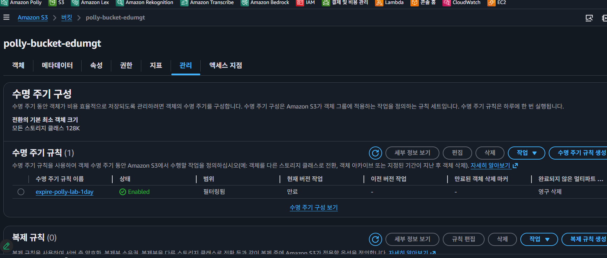

# TODO (실무 고도화 백로그)

> 목표: Amazon Polly 기반 TTS 서비스를 학습용에서 운영형으로 확장.

## 1) 스토리지/수명주기
```
debian@DESKTOP-OJOTK17:~/project/AI-AWS-Polly$ aws s3 ls
2026-01-17 20:48:14 elasticbeanstalk-ap-northeast-2-086015456585
2026-02-07 22:32:34 polly-bucket-edumgt
2025-12-16 10:39:27 www.edumgt.co.kr
2025-12-16 13:17:12 www.edumgt.co.kr.log
debian@DESKTOP-OJOTK17:~/project/AI-AWS-Polly$ aws s3 help

Could not find executable named "groff or mandoc"
debian@DESKTOP-OJOTK17:~/project/AI-AWS-Polly$ sudo apt update
sudo apt install -y groff-base
```
---

- [ ] S3 오디오 객체 자동 정리 설계
  - [ ] 옵션 A: Lifecycle Rule(일 단위)
---



---
```
aws events put-targets \
  --rule "polly-lab-objectcreated" \
  --targets '[
    {
      "Id": "create-delete-schedule",
      "Arn": "arn:aws:lambda:ap-northeast-2:086015456585:function:polly-create-delete-schedule"
    }
  ]'
```
---
```
aws lambda add-permission \
  --function-name polly-create-delete-schedule \
  --statement-id "AllowEventBridgeInvoke" \
  --action "lambda:InvokeFunction" \
  --principal events.amazonaws.com \
  --source-arn "arn:aws:events:ap-northeast-2:086015456585:rule/polly-lab-objectcreated"
```

  - [ ] 옵션 B: EventBridge + Lambda(정확히 1시간 후 삭제)
  - [ ] 객체 태그(`ttl=1h`) 기반 삭제 정책 검토
- [ ] Presigned URL 만료 정책 표준화(예: 5~15분)
- [ ] S3 버전닝/삭제마커가 비용에 미치는 영향 검증

## 2) Frontend 배포/웹 주소
- [ ] Frontend 정적 빌드 산출물 정의(필요 시 번들러 도입)
- [ ] S3 정적 호스팅 + CloudFront 구성
- [ ] Route53 커스텀 도메인 연결(`tts.example.com`)
- [ ] CloudFront 캐시 전략 수립(`index.html` no-cache, assets immutable)

## 3) CI/CD 자동화 (GitHub Actions)
- [ ] Lambda 자동 배포 워크플로 작성
- [ ] Frontend S3 sync + CloudFront invalidation 자동화
- [ ] 브랜치 전략별 배포 분리(dev/stage/prod)
- [ ] 배포 승인 게이트(Environment Protection Rules) 적용
- [ ] 배포 실패 롤백(runbook + 자동/수동 절차) 수립

## 4) 다국어 혼합 음성 품질
- [ ] ko/en/ja 혼합 텍스트 언어 구간 분리기 설계
- [ ] 구간별 Voice/Engine 매핑 정책 테이블 관리(JSON/YAML)
- [ ] SSML `<lang>`, `<phoneme>`, `<sub>` 활용 규칙 문서화
- [ ] 영어 약어(AI, AWS), 일본어 고유명사 발음 튜닝 케이스 축적
- [ ] 음질 평가 기준(MOS 유사 체크리스트) 정의 및 샘플 세트 구축

## 5) API/백엔드 안정성
- [ ] 요청 검증 스키마(zod/joi) 도입
- [ ] idempotency key 적용(중복 생성 방지)
- [ ] Polly/S3 에러코드별 재시도 정책 분리
- [ ] 동시성 제한 및 rate limiting 적용
- [ ] 대용량 입력 분할 합성(batch/chunk) 처리

## 6) 보안/권한
- [ ] IAM least privilege 재점검(Polly, S3, Logs)
- [ ] Lambda Function URL 공개 범위 최소화(필요 시 API Gateway 전환)
- [ ] CORS allowlist 운영 정책(환경별 도메인)
- [ ] 민감정보(키/토큰) GitHub Secrets/SSM Parameter Store 일원화

## 7) 관측성/운영
- [ ] 구조화 로그(JSON) 도입: requestId, latency, chars, voiceId
- [ ] CloudWatch 대시보드 생성(성공률/지연/비용)
- [ ] 알람 기준 설정(5xx 급증, 지연 증가, 비용 임계치)
- [ ] 운영 점검표(runbook) 작성: 장애 유형별 대응 절차

## 8) 비용 최적화
- [ ] 문자 수/엔진별 단가 기반 월 비용 예측 시트 작성
- [ ] 캐시 전략 도입(동일 텍스트+voice 조합 재사용)
- [ ] 장문 합성 시 우선순위 큐/비동기 처리 검토

## 9) 개발자 경험(DX)
- [ ] `.env.example` 표준화 및 환경변수 설명 강화
- [ ] 로컬 테스트 스크립트(`npm run smoke`) 추가
- [ ] API 예제 컬렉션(Postman/Bruno) 제공
- [ ] 문서 다국어(한국어/영어) 병행 정리

## 10) 품질/테스트
- [ ] 단위 테스트: 입력 검증/SSML 생성 로직
- [ ] 통합 테스트: Polly 호출 mock + S3 업로드 검증
- [ ] E2E 테스트: Frontend → Lambda → S3 재생 플로우
- [ ] 성능 테스트: 초당 요청량/지연/실패율 측정
