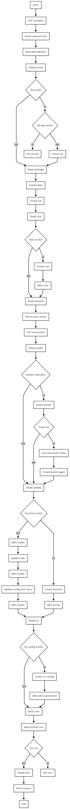

```mermaid
flowchart TD
  A[Start] --> B[Init variables]
  B --> C[Check required vars]
  C --> D[Read AWS identity]
  D --> S0

  S0[Step0 prereq] --> Z1{Zip exists}
  Z1 -- yes --> S1
  Z1 -- no --> Z2{Apt get exists}
  Z2 -- yes --> Z3[Install zip]
  Z3 --> S1
  Z2 -- no --> X1[Fail prereq]

  S1[Step1 package] --> P1[Install deps]
  P1 --> P2[Create zip]

  P2 --> S2[Step2 role]
  S2 --> R1{Role exists}
  R1 -- yes --> S3
  R1 -- no --> R2[Create role]
  R2 --> R3[Wait a bit]
  R3 --> S3

  S3[Step3 policies] --> I1[Attach basic policy]
  I1 --> I2[Put inline policy]

  I2 --> S4[Step4 bucket]
  S4 --> B1{Bucket reachable}
  B1 -- yes --> S5
  B1 -- no --> B2[Create bucket]
  B2 --> B3{Create ok}
  B3 -- yes --> S5
  B3 -- no --> B4[Use new bucket name]
  B4 --> B5[Create bucket again]
  B5 --> S5

  S5[Step5 lambda] --> L1{Function exists}
  L1 -- yes --> U1[Wait stable]
  U1 --> U2[Update code]
  U2 --> U3[Wait stable]
  U3 --> U4[Update config with retry]
  U4 --> U5[Wait stable]
  U5 --> S6
  L1 -- no --> N1[Create function]
  N1 --> N2[Wait active]
  N2 --> S6

  S6[Step6 url] --> F1{Url config exists}
  F1 -- yes --> S7
  F1 -- no --> F2[Create url config]
  F2 --> F3[Add public permission]
  F3 --> S7

  S7[Step7 cors] --> C1[Apply bucket cors]
  C1 --> C2{Cors ok}
  C2 -- yes --> S8
  C2 -- no --> X2[Fail cors]

  S8[Step8 done] --> O1[Print outputs]
  O1 --> E[End]
```
---
